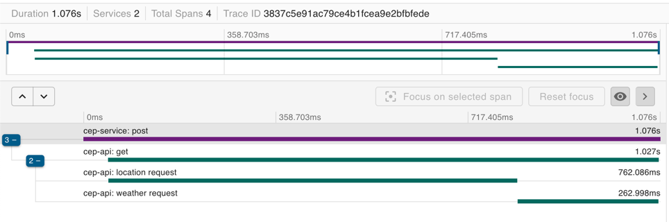

# Tracing distribuído e Span

## Como Iniciar a Aplicação
1. Na pasta raíz do projeto execute
```shell
docker-compose up --build
```
2. A API pode ser acessada pelo seguinte endereço:
```http request
http://localhost:8080/
```
3. O Zipkin pode ser acessado pelo seguinte endereço:
```http request
http://127.0.0.1:9411/zipkin/
```

## Utilizando a API
Para acessar a API é necessário realizar uma request http no seguinte formato, apenas alterando o CEP:
```http request
POST http://localhost:8080/ HTTP/1.1
Host: localhost:8000
Content-Type: application/json

{
  "cep": "99999999"
}
```
Após realizar a requisição o tracing e os spans estarão disponíveis no zipkin.

